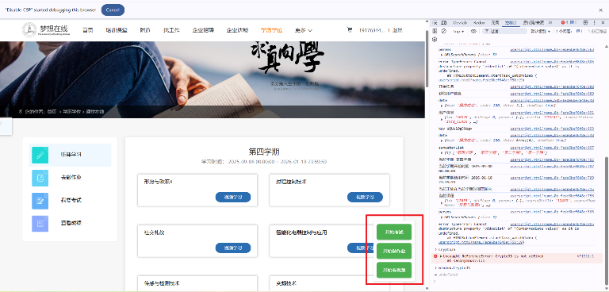

# 🎓 梦想在线学习助手

一个专为梦想在线教育平台设计的油猴脚本，帮助您自动化完成视频学习、作业提交和考试答题。

## ✨ 功能特性

- 🎬 **自动观看视频** - 自动完成所有课程视频的学习记录
- 📝 **自动完成作业** - 智能提交作业答案
- 📊 **自动参加考试** - 自动完成考试答题
- 🎨 **现代化界面** - 美观的浮动操作面板
- 🔒 **安全可靠** - 基于官方API，安全稳定

## 🚀 安装使用

### 第一步：安装油猴插件

1. 访问 [Tampermonkey官网](https://www.tampermonkey.net/)
2. 根据您的浏览器选择对应版本下载安装
3. 安装完成后，浏览器工具栏会出现油猴图标

### 第二步：创建用户脚本

1. 点击浏览器工具栏中的油猴图标
2. 选择"创建新脚本"
3. 清空默认内容，准备粘贴脚本代码

### 第三步：配置脚本

1. 复制 `userscript.js` 文件中的全部内容
2. 粘贴到新建的用户脚本中
3. **重要**：修改脚本中的文件路径为您的实际路径

```javascript
// 将以下路径修改为您的实际文件路径
// @require      file:///D:/Documents/dream-online/index.js
// @require      file:///D:/Documents/dream-online/doExam.js
// @require      file:///D:/Documents/dream-online/doHomeWork.js
// @require      file:///D:/Documents/dream-online/watchVideo.js
```

### 第四步：保存并启用

1. 按 `Ctrl + S` 保存脚本
2. 确保脚本状态为"已启用"
3. 访问 [梦想在线教育平台](https://www.mxdxedu.com/)

## 📖 使用说明

### 登录平台
首先需要在梦想在线教育平台完成登录，确保您有相应的学习权限。

### 使用功能
登录后，您会在页面右下角看到一个浮动的操作面板，包含以下按钮：

- **开始看视频** - 自动完成所有课程视频的学习
- **开始做作业** - 自动提交所有作业
- **开始考试** - 自动完成所有考试

### 操作流程
1. 点击相应功能按钮
2. 脚本会自动执行对应任务
3. 可在浏览器控制台查看执行日志
4. 任务完成后会有相应提示

## 📸 界面展示



*界面展示：右下角浮动操作面板，包含三个主要功能按钮*

## ⚠️ 注意事项

1. **文件路径配置**：使用前请确保修改脚本中的文件路径为您的实际路径
2. **网络环境**：确保网络连接稳定，避免任务执行中断
3. **登录状态**：使用前请确保已登录梦想在线教育平台
4. **浏览器兼容**：建议使用Chrome、Firefox等现代浏览器
5. **使用频率**：建议合理使用，避免过于频繁的操作

## 🔧 技术说明

- **脚本类型**：Tampermonkey用户脚本
- **目标网站**：https://www.mxdxedu.com/*
- **依赖库**：CryptoJS（用于数据加密）
- **主要功能**：API调用、数据加密、自动化操作

## 📁 文件结构

```
dream-online/
├── userscript.js      # 主脚本文件（油猴脚本入口）
├── index.js          # 核心功能模块
├── watchVideo.js     # 视频观看模块
├── doExam.js         # 考试模块
├── doHomeWork.js     # 作业模块
├── img/              # 图片资源
│   └── Snipaste_2025-09-05_09-05-13.png
└── README.md         # 说明文档
```

## 🆘 常见问题

**Q: 脚本无法正常运行？**
A: 请检查文件路径是否正确，确保所有JS文件都在指定位置。

**Q: 按钮没有出现？**
A: 请确保已登录平台，并刷新页面重新加载脚本。

**Q: 任务执行失败？**
A: 请检查网络连接，查看浏览器控制台的错误信息。

## 📄 免责声明

本脚本仅供学习交流使用，请遵守相关平台的使用条款。使用者需自行承担使用风险，作者不承担任何责任。

## 🤝 贡献

欢迎提交Issue和Pull Request来改进这个项目！

---

**祝您学习愉快！** 🎉
